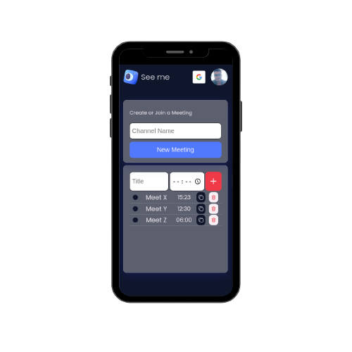
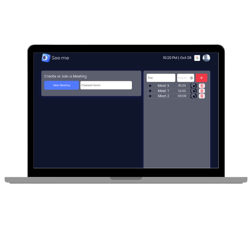

<!-- PROJECT LOGO -->
<br />
<div align="center">
  <a href="https://github.com/kirodoras/see-me-front">
    
  </a>

<!-- Link to src -->
  <h3 align="center">See me</h3>
  <p>
    Front end Development Project
    <br />
    <a href="https://github.com/kirodoras/see-me-front/tree/main/src"><strong>Browse Javacript code</strong></a>
    </p>
    <a href="https://github.com/kirodoras/see-me-back"><strong>Back end repository</strong></a>
</div>

<!-- Built With -->
<div align="center">
  <h3>Built With</h3>
  
  
  
    
  
</div>

<!-- Table of Contents -->

# Table of Contents

- [Description](#description)
- [Getting Started](#getting-started)
- [Video Call](#video-call)
- [Mobile app view](#mobile-app-view)
- [Desktop app view](#desktop-app-view)
- [Contact](#contact)

<!-- Description -->

# Description

An application to make video calls and organize them by time.

<ul>
    Main features:
    <li>Video call: agora.io <a href="https://docs.agora.io/en/video-calling/overview/product-overview">docs</a></li>
    <li>Login: google cloud api <a href="https://developers.google.com/identity/gsi/web/reference/js-reference">docs</a></li>
</ul>

<!-- Getting Started -->

# Getting Started

First of all configure an `.env` file following the `.env.example`

To clone the project, run the following command:

```git
git clone https://github.com/kirodoras/see-me-front
```

Then, navigate to the project folder and run the following command:

to install dependencies:

```git
npm i -y
```

Finally, start the app:

```git
npm run start
```

Deployed URL `https://see-me-front.vercel.app/`.

<!-- Video Call view -->

# Video Call
<div align="center">
  
</div>

# Mobile app view
<div align="center">
  
</div>

# Desktop app view
<div align="center">
  
</div>

<!-- Contact -->
# Contact

[![LinkedIn][linkedin-shield]][linkedin-url]

<!-- MARKDOWN LINKS & IMAGES -->

[linkedin-shield]: https://img.shields.io/badge/-LinkedIn-black.svg?style=for-the-badge&logo=linkedin&colorB=blue
[linkedin-url]: https://www.linkedin.com/in/mateus-figueiredo-pereira/
